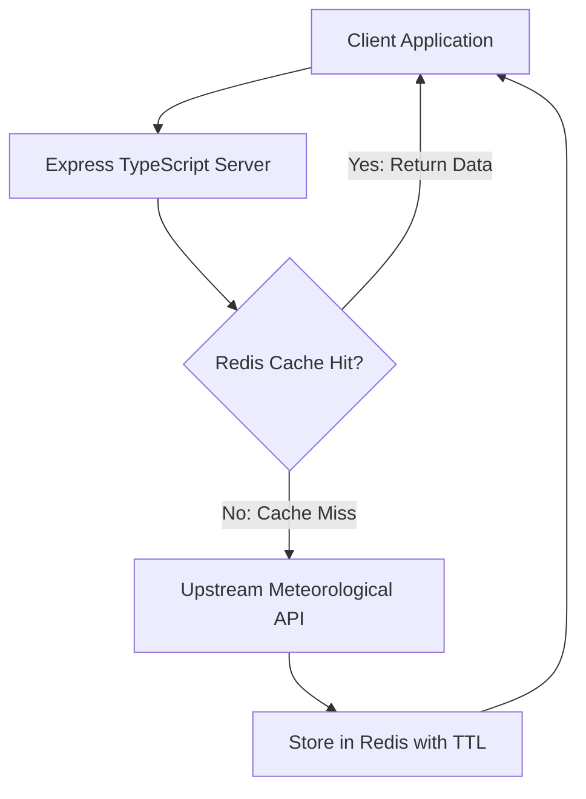

# Weather Redis Cache Service: Low-Latency Telemetry Backend

Scalable weather aggregation service built with TypeScript, Express.js, and Redis caching to prevent third-party rate limit exhaustion and deliver sub-millisecond response times.



## Architecture & Cache Strategy

- **Cache-Aside Pattern**: Incoming requests evaluate key `weather:{city}` in Redis. On cache hit, serialized JSON is returned directly without external I/O.
- **Bounded Expiration**: All cached weather payloads carry explicit TTL policies (e.g. 15 minutes) to ensure forecast freshness.
- **Network Resilience**: Upstream HTTP requests are managed via Axios with explicit timeout ceilings and retry safeguards.

## Technology Stack

- **Runtime**: Node.js, TypeScript 5+
- **Framework**: Express.js
- **Caching**: Redis via `ioredis`
- **HTTP Client**: Axios

## Running Locally

```bash
# Install dependencies
npm install

# Start development server with ts-node
npm start
```
