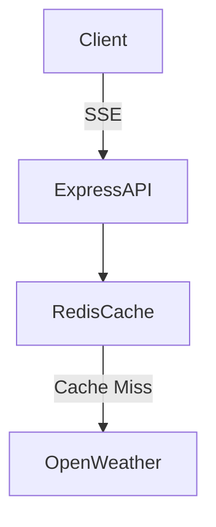

# weather

A real-time weather dashboard using OpenWeather API.

This application provides live weather updates utilizing Server-Sent Events (SSE). It caches API responses in Redis with a Time-To-Live (TTL) to prevent exceeding rate limits. The frontend is built with React and TypeScript.

### Tech
React, TypeScript, Express, Redis, OpenWeather API

### Architecture


### Getting started
```bash
npm install
npm start
```
